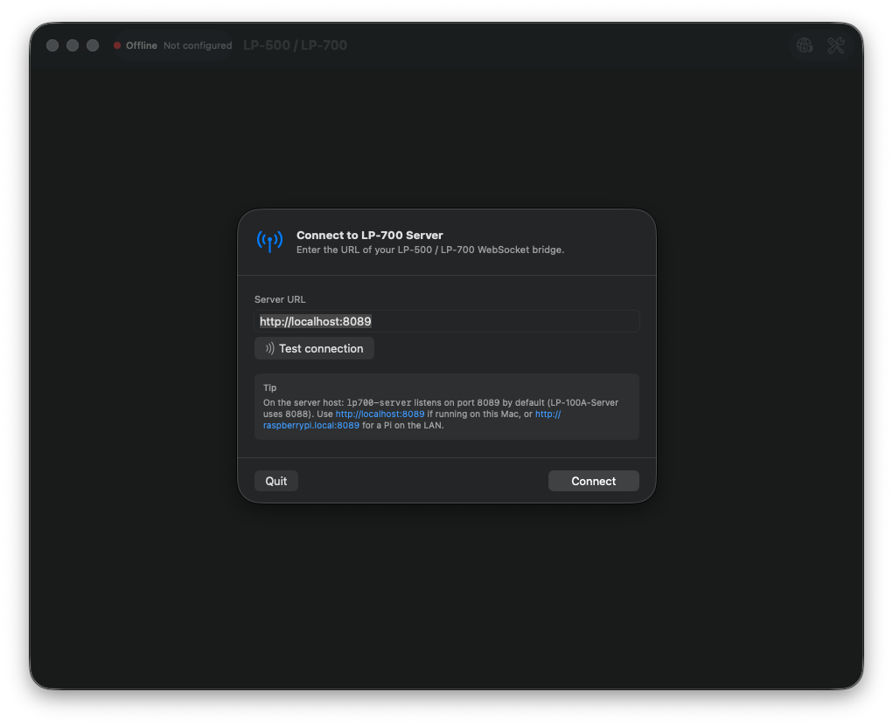
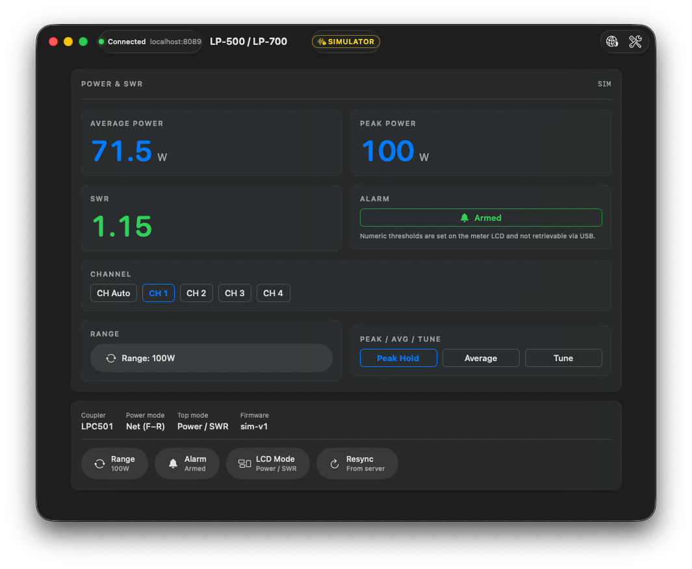
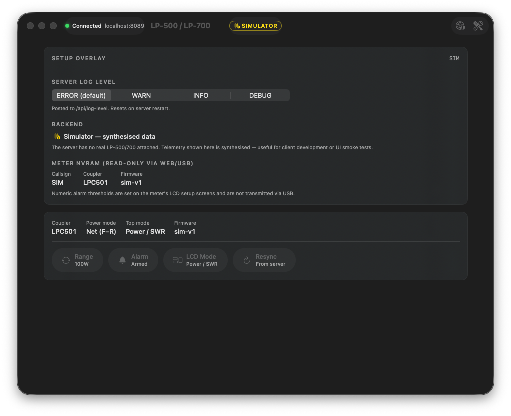
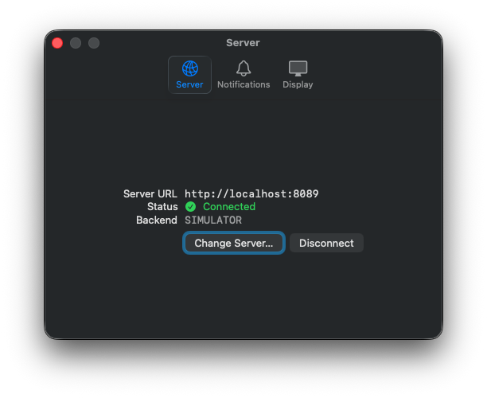

# LP-700-App — User Manual

**Version:** 0.1.0 · **Platform:** macOS 13 (Ventura) and later

LP-700-App is a native Mac client for the
[LP-700 WebSocket Server](https://github.com/VU3ESV/LP-700-Server). The
server owns the USB HID connection to your Telepost LP-500 / LP-700
Digital Station Monitor and exposes telemetry + control verbs over
WebSocket; this app is the desktop front-end that streams those
readings into a real Mac window with native toolbar, menu bar,
notifications, and keyboard shortcuts.

---

## 1. Install

### From a release DMG

1. Download `LP-700-App-<version>.dmg` from the
   [Releases page](https://github.com/VU3ESV/LP-700-App/releases).
2. Open the DMG and drag **LP-700-App.app** onto **Applications**.
3. The app is ad-hoc-signed (Apple Developer ID notarization is a
   follow-up item), so the first launch needs a one-time Gatekeeper
   bypass:
   ```sh
   xattr -dr com.apple.quarantine /Applications/LP-700-App.app
   ```
4. Launch from Spotlight, Launchpad, or `/Applications`.

> **Note** If you built the app yourself with `scripts/build-app.sh` or
> `scripts/install-local.sh`, no `xattr` step is needed —
> locally-built apps aren't quarantined (and the install script does
> the strip for you anyway).

### From source (one command, also installs to /Applications)

```sh
git clone https://github.com/VU3ESV/LP-700-App
cd LP-700-App
VERSION=$(git describe --tags --always 2>/dev/null || echo 0.0.0-dev) \
    ./scripts/install-local.sh
open /Applications/LP-700-App.app
```

---

## 2. First launch — connect to your server

The app opens a **Connect to LP-700 Server** sheet automatically the
first time it runs (no `serverURL` configured yet):



1. Enter the URL of your LP-700 WebSocket server.
   - Local server on this Mac: `http://localhost:8089`
   - Pi or other host on the LAN: `http://raspberrypi.local:8089`,
     `http://192.168.1.42:8089`, etc.
   - **Note:** the LP-700 server uses **port 8089**, not 8088 — that's
     the LP-100A server's port. The two can coexist on the same Pi.
2. Optionally hit **Test connection** — it probes `/healthz` on the
   server. A green check means reachable; an orange warning means the
   URL is wrong, the server isn't running, or the LAN can't see it.
3. Click **Connect** (or press **Enter**). The sheet closes and the
   app opens a WebSocket to the server. The server replies with an
   immediate snapshot, so your readouts populate within ~one poll
   cycle (~40 ms at default config).

If the server is unreachable, the connection badge in the toolbar
will show **Reconnecting** (yellow) and retry with exponential
backoff (0.5 s → 10 s) until either the server appears or you change
the URL via **File → Connect to Server… (⌘K)**.

---

## 3. The main window

Once connected, the main window splits into a toolbar, an instrument
panel mirroring the LP-500/700's Power/SWR LCD page, a status row,
and a keypad:



### 3.1 Toolbar

| Element | What it shows | Click |
|---|---|---|
| **Connection badge** | Green dot + "Connected" + host:port (or yellow "Reconnecting", or red "Offline") | (read-only — change server via the shield button or ⌘K) |
| **Backend pill** | `HID` (real meter attached) or `SIMULATOR` (yellow — synthesised data) | hover for tooltip |
| **Shield icon** | Server connection settings | Re-opens the **Connect to LP-700 Server** sheet so you can change URLs |
| **Wrench icon** | SETUP overlay | Toggles the SETUP overlay (see §4) |

### 3.2 POWER & SWR panel

This panel mirrors the LP-500/700's main LCD page. The wire frame
publishes both Avg and Peak power on every cycle regardless of the
meter's display mode, matching the small "57 AV / 94 PK" LCD
indicators that are always visible on the front panel.

- **Average power** — large blue numeric, units auto-scale (W → kW).
- **Peak power** — sticky maximum, decays after 1.5 s of no new max.
- **SWR** — coloured by severity:
  - **green** ≤ 1.5
  - **yellow** 1.5 – 2.0
  - **red** ≥ 2.0
- **Alarm pill** — Disabled / **Armed** (green) / **TRIPPED** (red).
  Click to toggle on/off via `alarm_toggle`. Numeric thresholds are
  set on the meter LCD's Setup screens and can't be transmitted via
  USB, so the app shows state only, not setpoint.
- **Channel pills** — `CH Auto` plus `CH 1`/`2`/`3`/`4`. The
  currently active slot is highlighted in the system tint.
- **Range** — `Range: 100W` (or 5W/10W/25W/50W/250W/500W/1K/2.5K/5K/10K/auto).
  Click to step through the cycle via `range_step`.
- **Peak / Avg / Tune** — three buttons that mirror the meter's F5
  cycle. The active mode is highlighted; clicking another sends
  `peak_toggle` with the corresponding value (0/1/2).
- **Status message** (when present) — orange banner. Populated when
  the meter sends an alert string (e.g. "Reduce power or lower
  range"), cleared when the meter clears it.

### 3.3 Status row

Below the meter panel:

- **Coupler** — `LPC501`/`LPC502`/`LPC503`/`LPC504`/`LPC505`. Set in
  the meter's Setup screens; read-only here.
- **Power mode** — `Net (F−R)` / `Delivered (F+R)` / `Forward`. Set
  on the meter; the wire decoder fills this from byte offsets defined
  in the user guide page 8.
- **Top mode** — which LCD page is active (`Power / SWR` /
  `Waveform` / `Spectrum` / `Setup`). The Waveform / Spectrum pages
  aren't mirrored to this app — they're rendered on the meter's
  built-in LCD only — but you can step the meter's display via the
  **LCD Mode** keypad button.
- **Firmware** — meter firmware revision, e.g. `v2.5.2b4`.

### 3.4 Keypad

The bottom row is the control surface:

| Button | Sends | Keyboard |
|---|---|---|
| **Range** | `range_step` (advances the range cycle) | ⌘R |
| **Alarm** | `alarm_toggle` (flips the alarm enabled/disabled) | ⌘A |
| **LCD Mode** | `mode_step` (cycles the meter's LCD page) | ⌘M |
| **Resync** | Asks the server to push the latest snapshot | ⌘Y |

If the server was started with `allow_control = false`, the keypad
shows "Read-only" on the right and all four buttons are disabled.
The Peak/Avg/Tune trio in the meter panel is also disabled in that
mode.

---

## 4. SETUP overlay

Toggle with the **wrench** toolbar button or **⌘.** (Cmd+period). The
overlay replaces the meter panel with a settings/info pane:



### 4.1 Server log level

Segmented picker over `error` / `warn` / `info` / `debug`. POSTs to
the server's `/api/log-level` endpoint, taking effect immediately —
no server restart needed. The level **resets** to `error` whenever
the server itself restarts; opening the overlay re-fetches the
current value.

This is purely a server-side log-volume control. Use `debug` while
diagnosing connection or HID issues; leave it on `error` for normal
operation so the Pi's journal stays quiet.

### 4.2 Backend annotation

Shows whether the server is in HID mode (real meter attached over
USB) or simulator mode (synthesised data). Same information as the
toolbar pill, but with a sentence of context — useful when you're
testing the client without hardware.

### 4.3 Meter NVRAM (read-only)

The fields the LP-500/700 stores in NVRAM and exposes over USB:
**callsign**, **coupler**, and **firmware revision**. Numeric alarm
thresholds (`alarm_power_w`, `alarm_swr`) live in NVRAM too, but
**aren't transmitted via USB** — confirmed by USB pcap audit of the
manufacturer's VM software. To see or change those numbers, use the
Setup screens on the meter's own LCD.

While the SETUP overlay is open, the keypad and the Peak/Avg/Tune
trio are disabled — clicking through controls during a setup
inspection is disorienting and could fire commands you didn't mean
to issue.

---

## 5. Preferences (⌘,)



Three tabs:

### 5.1 Server

- **Server URL** — read-only display of the currently configured URL.
  Click **Change Server…** to re-open the connection sheet.
- **Status** — green checkmark "Connected" / yellow refresh
  "Reconnecting…" / red X "Offline".
- **Backend** — `HID` or `SIMULATOR`, fetched from `/api/config` on
  connect.
- **Disconnect / Reconnect** button — does what it says.

### 5.2 Notifications

- **Notify when alarm trips** (default: on). When the meter raises
  `alarm_tripped` from false to true, the app posts a native macOS
  notification ("LP-700 — alarm tripped") with the current SWR.
  Throttled to one per 30 s so a hunting alarm during a TX session
  doesn't spam the system tray.

### 5.3 Display

- **Show menu-bar live readout** (default: on). Controls whether the
  `MenuBarExtra` glance is inserted at all. Restart the app to apply.

---

## 6. Menu bar glance

When the menu-bar item is enabled, it shows a compact connection-dot
+ Avg power + SWR readout in the system tray:

```
● 57W · 1.15
```

- Dot is green when connected, half-filled when reconnecting, hollow
  when offline.
- Click to open a popover with the full readout block (Avg / Peak /
  SWR / Range / CH / Mode / Alarm) plus three actions:
  - **Show LP-700 Window (⌘O)** — bring the main window forward.
  - **Connect to Server…** — open the connection sheet.
  - **Quit (⌘Q)**.

This is meant for "I just need a quick glance while I'm in another
app" — you don't need to keep the main window in front to monitor.

---

## 7. Keyboard shortcuts

### Application

| Shortcut | Action |
|---|---|
| **⌘K** | Connect to Server… (open the connection sheet) |
| **⇧⌘D** | Disconnect (if connected) / Reconnect (if offline) |
| **⌘,** | Preferences |
| **⌘Q** | Quit |

### Meter menu

| Shortcut | Action | Wire verb |
|---|---|---|
| **⌘R** | Step Range | `range_step` |
| **⇧⌘1** | Force Peak Hold | `peak_toggle` value=0 |
| **⇧⌘2** | Force Average | `peak_toggle` value=1 |
| **⇧⌘3** | Force Tune | `peak_toggle` value=2 |
| **⌘A** | Toggle Alarm | `alarm_toggle` |
| **⌘M** | Step LCD Mode | `mode_step` |
| **⌘Y** | Resync (request latest snapshot) | `resync` |
| **⌘.** | Toggle SETUP overlay | (UI-only) |

### Menu bar popover

| Shortcut | Action |
|---|---|
| **⌘O** | Show LP-700 Window |

---

## 8. Connection lifecycle (what to expect)

- **Sleep / wake.** When your Mac wakes from sleep, the app
  automatically reconnects on `NSWorkspace.didWakeNotification` —
  empirically more reliable than relying on the watchdog timeout
  alone after a long lid-closed period.
- **Server restart.** The WebSocket drops; the toolbar badge goes
  yellow ("Reconnecting") and the client backs off 0.5 s → 1 s → 2 s
  → … → 10 s until the server is back. Backoff resets to 0.5 s on a
  successful connect.
- **App became active.** The app issues a `resync` so you don't see
  stale telemetry if you've been in another app for a while.
- **No frames for >4 s while "connected".** A heartbeat watchdog
  drops the WS and forces a reconnect — twice the server's default
  `heartbeat_ms` (2000) so a missed heartbeat alone doesn't trigger
  it, but a hung connection does.

---

## 9. Troubleshooting

### "Offline" badge stays red, no readouts

- **Server not running?** SSH to the host and run
  `systemctl status lp700-server` (Pi) or check whatever you used
  to start it. Or curl `/healthz`:
  ```sh
  curl -sf http://raspberrypi.local:8089/healthz && echo OK
  ```
- **Wrong URL?** Hit **⌘K** to open the connect sheet and tap
  **Test connection**. The probe error message tells you what failed.
- **LAN-only?** The LP-700 server has no authentication and binds
  to a LAN interface by design. If you're on a coffee-shop wifi and
  the server is at home, you'll need a VPN (Tailscale, WireGuard) to
  reach it.

### Readouts show — but values are flat zeros

- Server is in **simulator** mode without a proper config? The
  toolbar pill says `SIMULATOR` (yellow). Check the server's
  `meter.backend` setting in `/etc/lp700-server/config.toml` and
  restart it.
- Real meter attached but readouts still flat? On the Pi:
  ```sh
  sudo /usr/local/bin/lp700-server probe -list   # is the meter visible?
  sudo /usr/local/bin/lp700-server probe -dump   # are frames flowing?
  ```
  See the upstream [LP-700-Server README](https://github.com/VU3ESV/LP-700-Server)
  for udev rules and IDs.

### Keypad buttons are greyed out

Either:
- Connection state is not "Connected" — wait for the badge to go
  green. Or
- The server was started with `allow_control = false` for read-only
  fan-out. Check the upper-right of the keypad row — it should say
  "Read-only" with a lock icon.

### "Server rejected" status banner pops up

The server NACKed a command. Most common causes:
- Server's command queue is full (rare; queue is 32 deep).
- Action is unknown to the server (e.g. you're talking to an older
  server build that doesn't recognise `mode_step`). Update the server.

The banner auto-dismisses after 5 s.

### Notifications aren't appearing

- macOS may have de-prioritised them. Check **System Settings →
  Notifications → LP-700-App** and re-enable.
- Or you toggled them off in **Preferences → Notifications**.

### Gatekeeper warns "LP-700-App can't be opened because Apple cannot check it for malicious software"

The app is ad-hoc-signed; macOS adds a quarantine xattr on download
that triggers this dialog. One-time fix:

```sh
xattr -dr com.apple.quarantine /Applications/LP-700-App.app
```

A future release will be Apple-notarized and won't need this step.

---

## 10. Regenerating these screenshots

If you make UI changes and want fresh screenshots:

```sh
# In one terminal, run the server in simulator mode:
cd ../LP-700-Server && go run . -backend simulator

# In another, drive the app with the screenshot launch flags:
cd LP-700-App
defaults write com.vu3esv.lp700-app serverURL "http://localhost:8089"

# Connect sheet:
defaults delete com.vu3esv.lp700-app serverURL 2>/dev/null
open /Applications/LP-700-App.app && sleep 4
./scripts/grab-screenshot.sh 01-connection-sheet 0

# Main view:
defaults write com.vu3esv.lp700-app serverURL "http://localhost:8089"
pkill -x LP-700-App; sleep 1; open /Applications/LP-700-App.app && sleep 5
./scripts/grab-screenshot.sh 02-power-swr-view 0

# SETUP overlay (uses --open-setup launch flag):
pkill -x LP-700-App; sleep 1
open -a LP-700-App --args --open-setup && sleep 5
./scripts/grab-screenshot.sh 03-setup-overlay 0

# Preferences (uses --open-prefs launch flag):
pkill -x LP-700-App; sleep 1
open -a LP-700-App --args --open-prefs && sleep 5
WINDOW_KIND=prefs ./scripts/grab-screenshot.sh 04-preferences 0
```

The launch flags (`--open-setup`, `--open-prefs`) are deliberate
shortcuts for screenshot capture; nothing in the production UI
depends on them, and they're a no-op without `argv` containing the
flag.

---

## 11. See also

- [README](../README.md) — install + build paths.
- [ARCHITECTURE.md](../ARCHITECTURE.md) — design review.
- [CLAUDE.md](../CLAUDE.md) — orientation for contributors.
- [VU3ESV/LP-700-Server](https://github.com/VU3ESV/LP-700-Server) —
  upstream WebSocket bridge.
- [VU3ESV/LP-100A-App](https://github.com/VU3ESV/LP-100A-App) — sister
  Mac client for the LP-100A; same shell, different telemetry shape.
